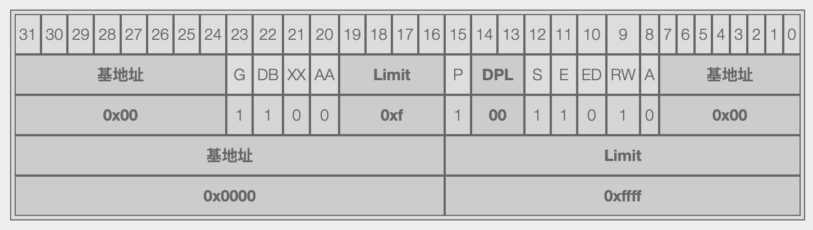
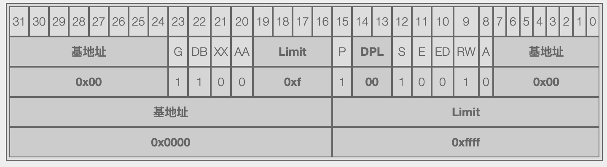
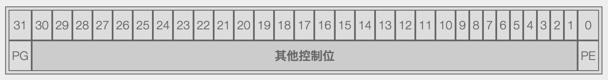
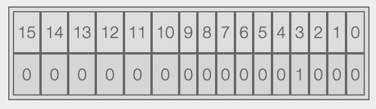

# The Boot Loader 

## x86 的启动

看具体的代码前先说说 x86 架构开机引导的相关知识。从给 x86 通电的一刻开始，CPU 执行的第一段指令是 BIOS 固化在 ROM 上的代码，这个过程是硬件定死的规矩，就是这样。

而 BIOS 在硬件自检完成后会根据你在 BIOS 里设置的启动顺序（硬盘、光驱、USB）读取每个引导设备的第一个扇区 512字节的内容，并判断这段内容的最后 2 字节是否为 0xAA55，如果是说明这个设备是可引导的，于是就将这 512 字节的内容放到内存的 0x7c00，然后告诉 CPU 去执行这个位置的指令。这个过程同样是硬件定死的规矩，就是这样。

有了上面的介绍我们再回到 xv6 如果你看一下编译生成的 bootblock 二进制文件，你会惊喜的发现它的文件大小刚好是 512 字节。用十六进制编辑器（我在 Mac OSX 下用的是 0xED 这个软件）打开 bootblock 这个二进制文件，你又会发现这个 512 字节的文件的最后两字节正好是 0xAA55。

看一下Makefile 中 bootblock的的生成代码
```
bootblock: bootasm.S bootmain.c
  $(CC) $(CFLAGS) -fno-pic -O -nostdinc -I. -c bootmain.c
  $(CC) $(CFLAGS) -fno-pic -nostdinc -I. -c bootasm.S
  $(LD) $(LDFLAGS) -N -e start -Ttext 0x7C00 -o bootblock.o bootasm.o bootmain.o
  $(OBJDUMP) -S bootblock.o > bootblock.asm
  $(OBJCOPY) -S -O binary -j .text bootblock.o bootblock
  ./sign.pl bootblock
```

$(LD)链接命令负责把'.o'文件链接为可执行文件。 上面说过BIOS会把引导扇区（boot sector）里的boot loader 加载到0x7C00的内存地址上，这也是boot loader开始执行的地方,这里的`-Ttext 0x7C00` 就是告诉链接器代码段的起始位置是0x7C00， 这样链接器就可以在产生的代码中生成正确的内存地址。可执行文件的入口是 start(通过`-e start` 设定)。这个可执行文件是ELF格式的，但是此时操作系统还未被加载运行无法识别ELF可执行文件，所以$(OBJCOPY)命令把bootblock.o这个ELF文件中的代码段（`-j .text`）按二进制的方式（`-O binary `）拷贝到bootblock文件中。./sign.pl这个命令负责把 boot loader 文件bootblock填充为512个字节大小，然后把末尾两个字节设置为 0xAA55 作为引导扇区的标示。

在 xv6.img 的生成代码中
 
```

 xv6.img: bootblock kernel fs.img  
  dd if=/dev/zero of=xv6.img count=10000
  dd if=bootblock of=xv6.img conv=notrunc
  dd if=kernel of=xv6.img seek=1 conv=notrunc

```
可以发现xv6.img 就是把bootblock和kernel拼接成一个文件，这个文件的大小是10000个扇区 （count=10000），bootbloack在第一个扇区，kernel被拼接到第一个扇区后边（seek=1）。
 
## 进入Boot Loader

在"x86 的启动"一节中讲到BIOS会把boot loader加载到内存的0x7c00的位置，然后跳转到这个位置去执行boot loader代码。此时控制权已经交给boot loader了. boot loader主要完成了两个功能：  

*  实模式切换到保护模式：从20位（1M）寻址实模式切换到32位(4G)寻址的保护模式
*  加载内核：根据ELF内核文件所指定的物理地址，从硬盘中把内核到内存中的该地址上，然后跳转到内核ELF文件所地址的入口点。

## 实模式到保护模式

首先理解一下实模式与保护模式。如果说进程是对CPU的抽象，文件是对硬盘的抽象，那么虚拟内存就是对物理内存的抽象。实际上计算机编程面对的都是虚拟内存，也就是说编程时存取数据的地址都是虚拟地址（也即逻辑地址），CPU把虚拟地址交给MMU（Memery management unit）转换为物理地址，再去访问物理内存。其实这里说的内存是一个地址空间（Adress Space）并不单指存取数据的内存，也包括一些外部设备比如显示器/键盘等，也就是说对这些外部设备读写也是被影射到特定的内存地址空间上。


实模式下MMU不会进行地址转换也就是说虚拟地址等于物理地址。实模式寻址的计算公式如下
```
16 ∗ selector + offset
```
第一个16位的值叫做selector是存储在段寄存器里的，第二个16位的值叫做offset.为什么要用这样的方式表示呢？原来早期英特尔的 8086 CPU 是 16 位的，如果直接用来表示内存地址的话，16 位最大可以表示的内存地址是 2^16 = 65536 个地址，每个地址代表一字节的内存数据的话，16 位最多只能支持 64KB 内存，这显然是不够用的。于是英特尔在保持数据线宽为 16 位的同时将地址线的宽度增大到 20 位，也就是说内存地址是 20 位的，这样就可以支持 2^20 = 1MB 的内存，当时的人们认为这样就足够了。现在问题来了，16 位的数据线宽（寄存器自然也是 16 位的）如何能表示 20 位的地址呢？答案是用两个 16 位的寄存器来表示。这就是“段基址” + “偏移量”寻址方式的由来。一个 16 位的寄存器来表示“段基址”（CS、DS、SS、ES四个寄存器），具体的做法是先将 16 位的“段基址”左移 4 位，然后加上 16 位的“偏移量”最终得到 20 位的内存地址送入地址线。


保护模式下面对的是虚拟地址，CPU进行存取数据时虚拟地址会被转换为物理地址，然后再去访问内存。保护模式分为两种，段保存模式和页保护模式。

段保护模式需要维护一张全局描述符表(GDT)，GDT记录了每个段对应的物理地址和长度以及其他的一些保护位。操作系统需要告诉CPU GDT所在的地址，CPU（MMU）通过CS段寄存器的段地址索引到某一条段表记录，找到对应段的段物理地址，再加上IP寄存器的偏移量就得到了物理地址。更多关于Memory segmentation的说明可以参考(wikipedia)[https://en.wikipedia.org/wiki/Memory_segmentation]

页保护模式需要维护一张页表，页表同样记录了每个页对应的物理地址，通常一个页的大小是4Kb,那么一个32位的地址的前20位是页表的索引，后12位是偏移量，操作系统需要告诉CPU页表的地址，CPU（MMU）通过虚拟地址的前20位索引到对应的页记录，找到对应页的物理地址，再加上虚拟地址后12位的偏移量得到物理地址。

### bootasm.S
下面看一下具体的代码，boot loader有两个文件bootasm.S和bootmain.c. boot loader的入口就在bootasm.S文件中
 
```
.code16                       # Assemble for 16-bit mode
.globl start
start:
  cli                         # BIOS enabled interrupts; disable

  # Zero data segment registers DS, ES, and SS.
  xorw    %ax,%ax             # Set %ax to zero
  movw    %ax,%ds             # -> Data Segment
  movw    %ax,%es             # -> Extra Segment
  movw    %ax,%ss             # -> Stack Segment
```

`.code16 `这句是诉 CPU 我们目前是在 16 位模式下执行代码，此时内存寻址能力只有 1MB，并且是“实模式”下。

cli 指令关闭了中断响应，意味着从这一刻开始你的计算机将不再响应任何中断事件（比如这时候你敲个键盘点个鼠标啥的，CPU 就不再理你了）。之所以要关闭中断响应是因为要保证引导代码的顺利执行（总不能执行到一半被 CPU 给中断了吧，那直接就挂了）。

接下来的 4 行代码显示用异或将 %ax 寄存器的值置成 0，然后在用 %ax 寄存器的值将 %ds、%es、%ss 三个寄存器的值全部置 0，相当于初始化了。

我们接着往下看 bootasm.S 的代码。在初始化好寄存器后，bootasm.S 接下来要做的事情就是打开 A20 gate 突破 1MB 内存寻址的限制。X86计算机要突破 1MB 内存寻址的限制就要把 A20 gate 打开，控制 A20 gate 的方法有 3 种：
* 804x 键盘控制器法
* Fast A20 法
* BIOS 中断法

xv6 用了第一种 804x 键盘控制器法，这也是最古老且效率最慢的一种。当然因为硬件的不同，这三种方法可能不会被硬件都支持，正确的做法应该是这三种都尝试一下，每尝试一个就验证一下 A20 gate 是否被正确打开以保证兼容各种硬件。但是 xv6 作为一款教学用的操作系统就没必要做的这么复杂里。只用了一种最古老的方法（保证兼容大多数硬件）而且没有对打开成功与否做验证。像诸如 Linux 这样的操作系统就把三种方法的实现都做好，并且加上了验证机制。


我们具体来看 xv6 的实现代码

```
# Physical address line A20 is tied to zero so that the first PCs 
  # with 2 MB would run software that assumed 1 MB.  Undo that.
  # ///////////////////////////////////////////////////////////////
  # 这里用了通过键盘控制器端口的方法打开 A20 地址
  # 打开 A20 地址线的方法有三种，具体可参考：
  #     http://kernelx.weebly.com/a20-address-line.html
  #
  # 下面都是针对 804x 键盘控制器端口的操作，这里只介绍用到的两个端口
  #     0x64  从该端口执行 in 读取操作时，读取状态寄存器，8 位，第二
  #           位标识输入缓冲是否有数据所以下面用 0x2 来 test 输入缓冲是否有数据
  #           向该端口执行 out 写操作时，代表向键盘控制器发送命令，发送 0xd1 代
  #           表要向键盘控制器的 P2 端口写入数据，要写入的数据通过 0x60 端口传入
  #
  #     P2    端口，8位，第二位就是 A20 开关，所以在 seta20.2 代码段将 0xdf 通过
  #           0x60 端口写入到 P2 时就会把 A20 置位，A20 打开后，进入保护模式
seta20.1:
  inb     $0x64,%al               # Wait for not busy
  testb   $0x2,%al
  jnz     seta20.1                # 通过 0x64 状态寄存器的第二位判断键盘缓冲区里是否有数据，如果还有数据，则等待

  movb    $0xd1,%al               # 0xd1 -> port 0x64
  outb    %al,$0x64               # 0xd1 代表向 804x 控制器的 P2 写数据

seta20.2:
  inb     $0x64,%al               # Wait for not busy
  testb   $0x2,%al
  jnz     seta20.2                # 同上，继续判断键盘缓冲区是否有数据，如果有数据，则等待

  movb    $0xdf,%al               # 0xdf -> port 0x60
  outb    %al,$0x60               # 将 0xdf 11011111 写入键盘控制器的 P2 口，意味着 A20 打开，进入保护模式
```
这里 bootasm.S 用了两个方法 seta20.1 和 seta20.2 来实现通过 804x 键盘控制器打开 A20 gate。 这个办法确实是分两步来搞的：

第一步是向 804x 键盘控制器的 0x64 端口发送命令。这里传送的命令是 0xd1，这个命令的意思是要向键盘控制器的 P2 写入数据。这就是 seta20.1 代码段所做的工作。

第二步就是向键盘控制器的 P2 端口写数据了。写数据的方法是把数据通过键盘控制器的 0x60 端口写进去。写入的数据是 0xdf，因为 A20 gate 就包含在键盘控制器的 P2 端口中，随着 0xdf 的写入，A20 gate 就被打开了。

接下来要做的就是进入“保护模式”了。在进入保护模式前需要将 GDT 准备好。什么是 GDT ？它的中文名称叫“全局描述符表”，想要在“保护模式”下对内存进行寻址就先要有 GDT，GDT 表里的每一项叫做“段描述符”，用来记录每个内存分段的一些属性信息，每个“段描述符”占 8 字节，我们先来看一眼这个段描述符的具体结构：

三块“基地址”组装起来正好就是 32 位的段起始内存地址，两块 Limit 组成该内存分段的长度，接下来依次解释一下其他位所代表的意义: 

* P: 0 本段不在内存中
* DPL: 访问该段内存所需权限等级 00 — 11，0为最大权限级别
* S: 1 代表数据段、代码段或堆栈段，0 代表系统段如中断门或调用门
* E: 1 代表代码段，可执行标记，0 代表数据段
* ED: 0 代表忽略特权级，1 代表遵守特权级
* RW: 如果是数据段（E=0）则1 代表可写入，0 代表只读；如果是代码段（E=1）则1 代表可读取，0 代表不可读取
* A: 1 表示该段内存访问过，0 表示没有被访问过
* G: 1 表示 20 位段界限单位是 4KB，最大长度 4GB；0 表示 20 位段界限单位是 1 字节，最大长度 1MB
* DB:1 表示地址和操作数是 32 位，0 表示地址和操作数是 16 位
* XX: 保留位永远是 0
* AA: 给系统提供的保留位

有了上述的解释，我们再来看看 xv6 是怎样准备自己的 GDT 的，代码在 bootasm.S 文件最底部：

```
gdt:
  SEG_NULLASM                             # 空
  SEG_ASM(STA_X|STA_R, 0x0, 0xffffffff)   # 代码段
  SEG_ASM(STA_W, 0x0, 0xffffffff)         # 数据（堆栈）段
```

这里用到了几个宏，具体的宏定义在 asm.h 文件中，为了方便大家直观的感受一下 xv6 的 GDT 我把宏计算出来的值直接翻译过来，代码应该是下面这个样子：

```
gdt:
  .word 0, 0;
  .byte 0, 0, 0, 0                             # 空
  .word 0xffff, 0x0000;
  .byte 0x00, 0x9a, 0xcf, 0x00                 # 代码段
  .word 0xffff, 0x0000;
  .byte 0x00, 0x92, 0xcf, 0x00                 # 数据段
```

然后我们再把代码段和数据段的段描述符具体每一位的对应值表展示出来，首先是代码段：

然后是数据段：


我们来一步步解释一下。首先说说这两个内存段的共同点，DB = 1，G = 1，基地址都是 0x00000000，内存分段长度都是 0xfffff，这说明他们都是用于 32 位寻址，所使用的内存是从 0 开始到 4GB 结束（全部内存）。这里是这么算出来的，段长度是 0xfffff = 2^20，G = 1 表示段界限单位是 4k，所以 4k * 2^20 = 4GB。

再说说他们的不同点，代码段的 E = 1 而数据段的 E = 0 这表名了他们的身份，身份不同 RW 的值虽然相同，但代表的意义也就不相同了，代码段的 RW = 1 代表可读取，数据段的 RW = 1 表示可读可写。这也和我们上面解释的保护模式所能够达到的目的相吻合。

当然作为一款教学为目的的操作系统，xv6 这里的 GDT 设置还是以简单容易理解为目的。诸如“权限位”这样的安全机制就直接被忽略了，而对内存的规划也没有做到真正的“分段”，而是代码段和数据段都启用了从 0 到 4GB 的全部内存寻址。其实这种内存规划方法叫做“平坦内存模型”，即便是 Linux 也是用的这样的方式规划内存的，并没有做到真正的“分段”。这是因为 x86 的分页机制是基于分段的，Linux 选用了更先进的分页机制来管理内存，所以在分段这里只是走一个必要的形式罢了。而 xv6 后面到底是否也启用了分页机制，我们目前还不得而知。


GDT 也搞定了，接下来我们就要把我们刚刚在内存中设定好的 GDT 的位置告诉 CPU，然后就“万事俱备，只欠东风”了。CPU 单独为我们准备了一个寄存器叫做 GDTR 用来保存我们 GDT 在内存中的位置和我们 GDT 的长度。GDTR 寄存器一共 48 位，其中高 32 位用来存储我们的 GDT 在内存中的位置，其余的低 16 位用来存我们的 GDT 的占用空间的大小（所占字节数）。 16 位可以表示的最大值为 65536 ，而一个段描述符是 8 字节，所以 GDT 最多可以有 8192 个段描述符。不仅 CPU 用了一个单独的寄存器 GDTR 来存储我们的 GDT，而且还专门提供了一个指令用来让我们把 GDT 的地址和长度传给 GDTR 寄存器，来看 xv6 的代码：

```
lgdt   gdtdesc
```
而这个 gdtdesc 和 gdt 一起放在了 bootasm.S 文件的最底部，我们看一眼：
```
gdtdesc:
  .word   (gdtdesc - gdt - 1)             # 16 位的 gdt 大小sizeof(gdt) - 1
  .long   gdt                             # 32 位的 gdt 所在物理地址
```

不多不少，正好 48 位传给了 GDTR 寄存器，到此 GDT 就准备好了，接下来我们进入保护模式！

前面讲到，就如同 A20 gate 这个开关负责打开 1MB 以上内存寻址一样，想要进入“保护模式”我们也需要打开一个开关，这个开关叫“控制寄存器”，x86 的控制寄存器一共有 4 个分别是 CR0、CR1、CR2、CR3，而控制进入“保护模式”的开关在 CR0 上，这四个寄存器都是 32 位的，我们看一下 CR0 上和保护模式有关的位


* PG 为 0 时代表只使用分段式，不使用分页式, 为 1 是启用分页式
* PE为 0 时代表关闭保护模式，运行在实模式下, 为 1 则开启保护模式

然后我们继续看 xv6 打开保护模式的代码：
```
movl    %cr0, %eax
orl     $CR0_PE, %eax
movl    %eax, %cr0
```

因为我们无法直接操作 CR0，所以我们首先要用一个通用寄存器来保存当前 CR0 寄存器的值，这里第一行就是用通用寄存器 eax 来保存 cr0 寄存器的值；然后 CR0_PE 这个宏的定义在 mmu.h 文件中，是个数值 0x00000001，将这个数值与 eax 中的 cr0 寄存器的值做“或”运算后，就保证将 cr0 的第 0 位设置成了 1 即 PE = 1 保证打开了保护模式的开关。而 cr0 的第 31 位 PG = 0 表示我们只使用分段式，不使用分页，这时再将新的计算后的 eax 寄存器中的值写回到 cr0 寄存器中就完成了到保护模式的切换。


到这里我们关于 xv6 从实模式到保护模式的讲解就接近尾声了。我们已经进入到保护模式了，接下来可以将代码彻底以 32 位的保护模式来运行了。所以这时我们的 xv6 也要准备跳转了，再来看一行代码：
```
ljmp  $(SEG_KCODE<<3) $start32
```
这是一个跳转语句，通知 CPU 跳转到指定位置继续执行指令。 xv6 在这时就准备跳转到用 C 写成的代码处去继续运行了。这个跳转语句的两个参数就是我们之前一直再讲的典型的“基地址” + “偏移量”的方式告诉 CPU 要跳转到内存的什么位置去继续执行指令。

而这时我们已经在分段式的保护模式下了，所以我们通过这句跳转语句来直观的感受一下分段式保护模式下的内存寻址。

前面预备知识里说道在分段式保护模式下“段基址”（基地址）不再是内存地址，而是 GDT 表的下标。上面我们也说过 GDT 表最大可以有 8192 个表项（段描述符），213 = 8192，所以保存着“段基址”的 16 位段寄存器只需要其中的 13 位就可以表示一个 GDT 表的下标，其余的 3 位可用作他用。

按照这个思路我们看看这个 $(SEG_KCODE<<3) 生成的“段基址”是什么？SEG_KCODE 是个宏定义，具体的定义在 mmu.h 文件中，我们翻译过来就是 $(1<<3)，再将它运算出来得到

这里这个 16 位的“段基址”的高 13 位代表 GDT 表的下标（学名应该叫“段选择子”），这里高 13 位刚好是 1，而我们的 GDT 里下标位 1 的内存段正好是我们的“代码段”，而“代码段”我们在 GDT 的“段描述符”中设置了它的其实内存地址是 0x00000000 ，内存段长度是 `1M*4K` ，这是完整的 4GB 内存。

所以这里的跳转语句选择了“代码段”，由于“代码段”的起始内存地址是 0x00000000 ，长度是完整的 4GB，所以后面的“偏移量”仍然相当于是实际的内存地址，所以这里“偏移量”直接用了 $start32，也就是 start32 直接对应的代码位置。通过这个跳转实际上 CPU 就会跳转到 bootasm.S 文件的 start32 标识符处继续执行了。

## 加载内核

boot loader 实现的第二个功能就是加载内核。也就是根据ELF内核文件所指定的load address，从硬盘中把内核加载到内存中对应的load address上，然后跳转到内核ELF文件所指定的入口点。


### ELF文件格式
在 [Wiki 百科上有 ELF 文件格式的详细解释](https://en.wikipedia.org/wiki/Executable_and_Linkable_Format)，简单的说 ELF 文件格式是 Linux 下可执行文件的标准格式。就好像 Windows 操作系统里的可执行文件 .exe 一样（当然，Windows 里的可执行文件的标准格式叫 PE 文件格式），Linux 操作系统里的可执行文件也有它自己的格式。只有按照文件标准格式组织好的可执行文件操作系统才知道如何加载运行它。我们并使使用 C 语言按照教科书写出的 HelloWorld 代码在 Linux 环境下最终通过编译器（gcc等）编译出的可以运行的程序就是 ELF 文件格式的。

那么 ELF 文件格式具体的结构是怎样的呢？ 大概是下面这个样子的。

| ELF 头部 ( ELF Header )        | 
|-------------------------------|
| 程序头表 (Program Header Table) |  
| .text                         | 
| .rodata                       | 
| ……                            |
| 节头表 (Section Header Table)  |


我们可以用 `readelf -h kernel` 命令来检查 ELF header 信息。 
```
$ readelf -h kernel
ELF Header:
  Magic:   7f 45 4c 46 01 01 01 00 00 00 00 00 00 00 00 00 
  Class:                             ELF32
  Data:                              2's complement, little endian
  Version:                           1 (current)
  OS/ABI:                            UNIX - System V
  ABI Version:                       0
  Type:                              EXEC (Executable file)
  Machine:                           Intel 80386
  Version:                           0x1
  Entry point address:               0x10000c
  Start of program headers:          52 (bytes into file)
  Start of section headers:          212404 (bytes into file)
  Flags:                             0x0
  Size of this header:               52 (bytes)
  Size of program headers:           32 (bytes)
  Number of program headers:         3
  Size of section headers:           40 (bytes)
  Number of section headers:         16
  Section header string table index: 15

```
这里的 ‘Start of program headers’ 记录的是program headers table在这个ELF文件中的位置，‘Size of program headers’是program headers table中一条记录的大小，‘Number of program headers’ 是program headers table的记录的条数。‘Entry point address’是程序的入口，程序被加载完成后会跳转到这个位置执行。
 

同样我们再通过 `readelf -l kernel` 命令来检查program headers 信息。
```
$ readelf -l kernel
Elf file type is EXEC (Executable file)
Entry point 0x10000c
There are 3 program headers, starting at offset 52

Program Headers:
  Type           Offset   VirtAddr   PhysAddr   FileSiz MemSiz  Flg Align
  LOAD           0x001000 0x80100000 0x00100000 0x07aab 0x07aab R E 0x1000
  LOAD           0x009000 0x80108000 0x00108000 0x02516 0x0d4a8 RW  0x1000
  GNU_STACK      0x000000 0x00000000 0x00000000 0x00000 0x00000 RWE 0x10

 Section to Segment mapping:
  Segment Sections...
   00     .text .rodata 
   01     .data .bss 
   02     

```
ELF program headers 记录了需要被加载的部分在文件中的起始位置（Offset）和大小（FileSiz），这些要被加载的segment通常包含一个或多个section, 这些section 在Section to Segment mapping那里可以看到。boot loader 就是根据ELF program headers决定如何加载各个段，program headers明确说明了哪一部分需要被加载到内存的哪个位置。

这里的LOAD是需要被加载到内存中的段的标记。VirtAddr（link address）是编译器在link的时候所生成的地址，是程序代码执行的时候所期望的地址，这个地址通常是虚拟地址（virtual address），程序代码里面函数和变量所在的地址就是link addrees。PhysAddr（load address ）是表示这一段代码被加载的时候就加载到到内存的这个物理地址上。


通过'Section to Segment mapping:'那段信息我们还可以看到，第一个 Segment 包含 .text .rodata 两个section,第二个Segment保护.data .bss 两个两个section。我们通过`readelf -S kernel`命令看看ELF文件的Section Headers。
```
$ readelf -S kernel
There are 16 section headers, starting at offset 0x33db4:

Section Headers:
  [Nr] Name              Type            Addr     Off    Size   ES Flg Lk Inf Al
  [ 0]                   NULL            00000000 000000 000000 00      0   0  0
  [ 1] .text             PROGBITS        80100000 001000 0070da 00  AX  0   0 16
  [ 2] .rodata           PROGBITS        801070e0 0080e0 0009cb 00   A  0   0 32
  [ 3] .data             PROGBITS        80108000 009000 002516 00  WA  0   0 4096
  [ 4] .bss              NOBITS          8010a520 00b516 00af88 00  WA  0   0 32
  [ 5] .debug_line       PROGBITS        00000000 00b516 006cb5 00      0   0  1
  [ 6] .debug_info       PROGBITS        00000000 0121cb 0121ce 00      0   0  1
  [ 7] .debug_abbrev     PROGBITS        00000000 024399 003fd7 00      0   0  1
  [ 8] .debug_aranges    PROGBITS        00000000 028370 0003a8 00      0   0  8
  [ 9] .debug_str        PROGBITS        00000000 028718 000eb6 01  MS  0   0  1
  [10] .debug_loc        PROGBITS        00000000 0295ce 00681e 00      0   0  1
  [11] .debug_ranges     PROGBITS        00000000 02fdec 000d08 00      0   0  1
  [12] .comment          PROGBITS        00000000 030af4 00002b 01  MS  0   0  1
  [13] .symtab           SYMTAB          00000000 030b20 002050 10     14  78  4
  [14] .strtab           STRTAB          00000000 032b70 0011ac 00      0   0  1
  [15] .shstrtab         STRTAB          00000000 033d1c 000096 00      0   0  1
Key to Flags:
  W (write), A (alloc), X (execute), M (merge), S (strings), I (info),
  L (link order), O (extra OS processing required), G (group), T (TLS),
  C (compressed), x (unknown), o (OS specific), E (exclude),
  p (processor specific)

```
这里可以看到'.text section'在文件中的位置（Off）是001000 大小是0070da，紧跟其后的是‘.rodata’，它的位置应该是`001000 + 0070da = 0080da`，可是.rodata 的Off 却显示0080e0，这是因为.rodata是按32个字节对齐的（Al）, 0080da 按32个字节对齐后就是0080e0，'.rodata'的起始位置（off=0080e0） + 它的大小（size=0009cb） = 008aab 这就是‘.rodata’的结束位置, ‘.rodata’的结束位置 008aab - ‘.text’ 的起始位置 001000 = 007aab 正是Program Headers中第一个segment的大小（FileSiz）。这正是因为第一个segment 包含 text .rodata 这两个section, 而编译器会把每个segment中包含的sections 放在一起按顺序排列. 同样的道理第二个segment也是这样的情况。

xv6 的elf.h 文件中有关于ELF header和program header 的详细定义.


### 从 bootmain 开始

在“从实模式到保护模式那一节中”我们写到
> 通过这个跳转实际上 CPU 就会跳转到 bootasm.S 文件的 start32 标识符处继续执行了
我们打开 bootasm.S 文件看看对应的 start32 位置处的代码做了什么事情。

```
.code32  # Tell assembler to generate 32-bit code now.
start32:
  # Set up the protected-mode data segment registers
  # 像上面讲 ljmp 时所说的，这时候已经在保护模式下了
  # 数据段在 GDT 中的下标是 2，所以这里数据段的段选择子是 2 << 3 = 0000 0000 0001 0000
  # 这 16 位的段选择子中的前 13 位是 GDT 段表下标，这里前 13 位的值是 2 代表选择了数据段
  # 这里将 3 个数据段寄存器都赋值成数据段段选择子的值
  movw    $(SEG_KDATA<<3), %ax    # Our data segment selector  段选择子赋值给 ax 寄存器
  movw    %ax, %ds                # -> DS: Data Segment        初始化数据段寄存器
  movw    %ax, %es                # -> ES: Extra Segment       初始化扩展段寄存器
  movw    %ax, %ss                # -> SS: Stack Segment       初始化堆栈段寄存器
  movw    $0, %ax                 # Zero segments not ready for use  ax 寄存器清零
  movw    %ax, %fs                # -> FS                      辅助寄存器清零
  movw    %ax, %gs                # -> GS                      辅助寄存器清零

  # Set up the stack pointer and call into C.
  movl    $start, %esp
  call    bootmain
```
这里在初始化了一些寄存器后直接调用了一个叫做 bootmain 的函数，而这个函数是写在 bootmain.c 文件中的，终于我们暂时告别了汇编来到了 C 的世界了。来看看 bootmain 函数在做什么事情。


bootmain.c 这个文件很小，代码很少，它其实是引导工作的最后部分（引导的大部分工作都在 bootasm.S 中实现），它负责将内核从硬盘上加载到内存中，然后开始执行内核中的程序。我们来看代码。
```C

void
bootmain(void)
{
  struct elfhdr *elf;
  struct proghdr *ph, *eph;
  void (*entry)(void);
  uchar* pa;

  // 从 0xa0000 到 0xfffff 的物理地址范围属于设备空间，
  // 所以内核放置在 0x10000 处开始
  elf = (struct elfhdr*)0x10000;  // scratch space

  // 从内核所在硬盘位置读取一内存页 4kb 数据
  readseg((uchar*)elf, 4096, 0);

  // 判断是否为 ELF 文件格式
  if(elf->magic != ELF_MAGIC)
    return;  // let bootasm.S handle error

  // 加载 ELF 文件中的程序段 (ignores ph flags).
  ph = (struct proghdr*)((uchar*)elf + elf->phoff);
  eph = ph + elf->phnum;
  for(; ph < eph; ph++){
    pa = (uchar*)ph->paddr;
    readseg(pa, ph->filesz, ph->off);
    if(ph->memsz > ph->filesz)
      stosb(pa + ph->filesz, 0, ph->memsz - ph->filesz);
  }

  // Call the entry point from the ELF header.
  // Does not return!
  entry = (void(*)(void))(elf->entry);
  entry();
}
```

这里的elfhdr就是ELF header, proghdr就是program header, for 循环中的代码实现了把ELF kernel 文件中的segment所记录的被加载区域加载到对应segment指定的物理地址上（ph->paddr），ph->off是被加载区域在ELF文件中的起始位置， ph->filesz是被加载区域的实际大小，当 ph->memsz 大于ph->filesz时，剩余的区间要填充为0。加载完成后跳转到入口函数（elf->entry）开始运行内核。
 

最后我们看一下读取磁盘信息的方法实现，看看是怎样通过向特定端口发送数据来达到操作磁盘目的的。
```C
// Read a single sector at offset into dst.
// 这里使用的是 LBA 磁盘寻址模式
// LBA是非常单纯的一种寻址模式﹔从0开始编号来定位区块，
// 第一区块LBA=0，第二区块LBA=1，依此类推
void
readsect(void *dst, uint offset)      // 0x10000, 1
{
  // Issue command.
  waitdisk();
  outb(0x1F2, 1);                     // 要读取的扇区数量 count = 1
  outb(0x1F3, offset);                // 扇区 LBA 地址的 0-7 位
  outb(0x1F4, offset >> 8);           // 扇区 LBA 地址的 8-15 位
  outb(0x1F5, offset >> 16);          // 扇区 LBA 地址的 16-23 位
  outb(0x1F6, (offset >> 24) | 0xE0); // offset | 11100000 保证高三位恒为 1
                                      //         第7位     恒为1
                                      //         第6位     LBA模式的开关，置1为LBA模式
                                      //         第5位     恒为1
                                      //         第4位     为0代表主硬盘、为1代表从硬盘
                                      //         第3~0位   扇区 LBA 地址的 24-27 位
  outb(0x1F7, 0x20);                  // 20h为读，30h为写

  // Read data.
  waitdisk();
  insl(0x1F0, dst, SECTSIZE/4);
}
```
我们已经讲到了如何通过向 804x 键盘控制器端口发送信号来打开 A20 gate 了，同样道理，我们向硬盘控制器的指定端口发送信号就可以操作硬盘，从硬盘读取或向硬盘写入数据。IDE 标准定义了 8 个寄存器来操作硬盘。PC 体系结构将第一个硬盘控制器映射到端口 1F0-1F7 处，而第二个硬盘控制器则被映射到端口 170-177 处。这几个寄存器的描述如下（以第一个控制器为例）：

```
1F0        - 数据寄存器。读写数据都必须通过这个寄存器

1F1        - 错误寄存器，每一位代表一类错误。全零表示操作成功。

1F2        - 扇区计数。这里面存放你要操作的扇区数量

1F3        - 扇区LBA地址的0-7位

1F4        - 扇区LBA地址的8-15位

1F5        - 扇区LBA地址的16-23位

1F6 (低4位) - 扇区LBA地址的24-27位

1F6 (第4位) - 0表示选择主盘，1表示选择从盘

1F6 (5-7位) - 必须为1

1F7 (写)    - 命令寄存器

1F7 (读)    - 状态寄存器

              bit 7 = 1  控制器忙
              bit 6 = 1  驱动器就绪
              bit 5 = 1  设备错误
              bit 4        N/A
              bit 3 = 1  扇区缓冲区错误
              bit 2 = 1  磁盘已被读校验
              bit 1        N/A
              bit 0 = 1  上一次命令执行失败
```


### 内核加载后的系统内存布局

至此内核已经被载入内存并准备投入运行了。在结束这一篇前我们再看一眼目前状态下系统整体的内存布局，对即将运行的内核环境有一个大致的了解。
从 bootasm.S 文件的代码
```
 movl    $start, %esp            # 栈顶被放置在 0x7C00 处，即 $start
```
可知，执行 bootmain.c 之前 bootasm.S 汇编代码已经将栈的栈顶设置在了 0x7C00 处。之前我们了解过 x86 架构计算机的启动过程，BIOS 会将引导扇区的引导程序加载到 0x7C00 处并引导 CPU 从此处开始运行，故栈顶即被设置在了和引导程序一致的内存位置上。我们知道栈是自栈顶开始向下增长的，所以这里栈会逐渐远离引导程序，所以这里这样安置栈顶的位置并无什么问题。

在 bootmain.c 文件的代码
```
 elf = (struct elfhdr*)0x10000;

  // 从内核所在硬盘位置读取一内存页 4kb 数据
  readseg((uchar*)elf, 4096, 0);
```
可以看出boot loader 先把内核ELF（Executable and Linkable Format）加载到 0x10000 (64K)位置(实际上这是一个任意选取的临时存放的位置)，然后从这个位置开始读取 ELF header 和 program header , 根据programe header里的段记录的加载对应的代码段和数据段到paddr指定的位置，其中代码段的paddr是0x100000(1M)	,数据段的paddr是0x00108000.
所以加载完内核后的内存布局示意图如下:

```
                      +------------------------------+  
                      |                              | 
                      |       kernel data            | 
                      +------------------------------+ 0x00108000 
                      |                              |        
                      |       kernel code            |
                      +------------------------------+ 0x00100000     
                      |                              |
                      |                              |
                      |                              |
                      +------------------------------+ 0x00007d00 
                      |                              |
                      |      boot loader             |
     STACK -------->  +------------------------------+ 0x00007c00
     grow down        |                              |
                      |      stack                   |
                      +------------------------------+ 0x00000000               
 
```

参考：
> http://leenjewel.github.io/blog/2014/07/29/%5B%28xue-xi-xv6%29%5D-cong-shi-mo-shi-dao-bao-hu-mo-shi/