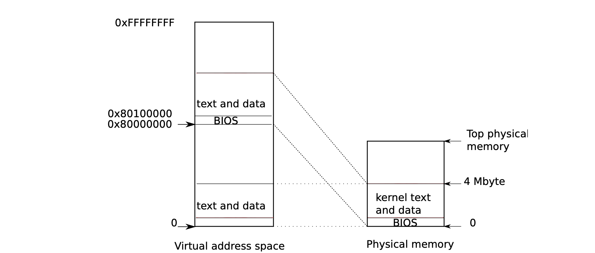

# 运行内核

在boot loader 加载完内核后，通过elf header的e_entry进入内核的入口
```
((void (*)(void)) (ELFHDR->e_entry))();
```

这个入口在'entry.S'文件中，这个文件完成的功能是开启分页模式，并告诉CPU页表的地址。值得注意的是因为我们的运行的代码是面向虚拟地址的，但是在开启分页模式之前，这些虚拟地址都还是无效的，所以要把虚拟地址转换为物理地址，这里的物理实际是线性地址，也就是前面在 boot loader 中讲到的32位寻址的段保护模式，这里的线性地址等于物理地址。V2P_WO 就是实现虚拟地址向物理地址转换的一个宏。看一下V2P_WO 的实现代码
```C
#define V2P_WO(x) ((x) - KERNBASE) 
```
即，物理地址=虚拟地址-KERNBASE。为什么会是这样哪，实际上在boot loader的讲解中，我们已经通过命令‘readelf -l kernel’分析过kernel elf文件的Program Headers
```
$ readelf -l kernel
Elf file type is EXEC (Executable file)
Entry point 0x10000c
There are 3 program headers, starting at offset 52

Program Headers:
  Type           Offset   VirtAddr   PhysAddr   FileSiz MemSiz  Flg Align
  LOAD           0x001000 0x80100000 0x00100000 0x07aab 0x07aab R E 0x1000
  LOAD           0x009000 0x80108000 0x00108000 0x02516 0x0d4a8 RW  0x1000
  GNU_STACK      0x000000 0x00000000 0x00000000 0x00000 0x00000 RWE 0x10

 Section to Segment mapping:
  Segment Sections...
   00     .text .rodata 
   01     .data .bss 
   02     
```
在这里可以发现两个可以load的段的虚拟地址和物理地址差了0x80000000，正是KERNBASE的值。实际上虚拟地址和物理地址的位置都是在kernel.ld文件中设置的
```
SECTIONS
{
	/* Link the kernel at this address: "." means the current address */
        /* Must be equal to KERNLINK */
	. = 0x80100000;

	.text : AT(0x100000) {
		*(.text .stub .text.* .gnu.linkonce.t.*)
	}

	......
}
```


## 开启 4MB 内存分页支持
这是通过设置寄存器 cr4 的 PSE 位来完成的。cr4 寄存器是个 32 位的寄存器目前只用到低 21 位，每一位的至位都控制着一些功能的状态，所以 cr4 寄存器又叫做控制寄存器。

PSE 位是 cr4 控制寄存器的第 5 位，当该位置为 1 时表示内存页大小为 4MB，当置为 0 时表示内存页大小为 4KB。
```
# Turn on page size extension for 4Mbyte pages
movl    %cr4, %eax
orl     $(CR4_PSE), %eax
movl    %eax, %cr4
```

cr3 寄存器中保存着页表所在的内存物理地址

```
  # Set page directory
  movl    $(V2P_WO(entrypgdir)), %eax
  movl    %eax, %cr3
 
```
cr0控制分页模式的开启，（在boot loader中讲过）。
```
 # Turn on paging.
  movl    %cr0, %eax
  orl     $(CR0_PG|CR0_WP), %eax
  movl    %eax, %cr0
```

页表entrypgdir的代码如下：
```
// The boot page table used in entry.S and entryother.S.
// Page directories (and page tables) must start on page boundaries,
// hence the __aligned__ attribute.
// PTE_PS in a page directory entry enables 4Mbyte pages.

__attribute__((__aligned__(PGSIZE)))
pde_t entrypgdir[NPDENTRIES] = {
  // Map VA's [0, 4MB) to PA's [0, 4MB)
  [0] = (0) | PTE_P | PTE_W | PTE_PS,
  // Map VA's [KERNBASE, KERNBASE+4MB) to PA's [0, 4MB)
  [KERNBASE>>PDXSHIFT] = (0) | PTE_P | PTE_W | PTE_PS,
};

```
每条页表的记录是32位大小，这是个只有一级的页面，所以它的前20位是页表索引，后12位代表的意义如下：
```
+ 11 + 10 + 9 + 8 +  7 + 6 + 5 +  4  +  3  + 2  + 1  + 0 +
|    Avail    | G | PS | D | A | PCD | PWT | US | RW | P |
+--------------------------------------------------------+
|     000     | 0 |  1 | 0 | 0 |  0  |  0  |  0 |  1 | 1 |
+--------------------------------------------------------+

P     : 0 表示此页不在物理内存中，1 表示此页在物理内存中
RW    : 0 表示只读，1 表示可读可写（要配合 US 位）
US    : 0 表示特权级页面，1 表示普通权限页面
PWT   : 1 表示写这个页面时直接写入内存，0 表示先写到缓存中
PCD   : 1 表示该页禁用缓存机制，0 表示启用缓存
A     : 当该页被初始化时为 0，一但进行过读/写则置为 1
D     : 脏页标记（这里就不做具体介绍了）
PS    : 0 表示页面大小为 4KB，1 表示页面大小为 4MB
G     : 1 表示页面为共享页面（这里就不做具体介绍了）
Avail : 3 位保留位
```
通过上面的页表可以看出，在KERNBASE到KERNBASE+4M之间的虚拟地址对应的页表记录的基地址是0,那么这一段的“物理地址=虚拟地址-KERNBASE”与前面V2P_WO的计算相同。而在0到4M之间的虚拟地址对应的页表记录的基地址也是0，所以这一段的虚拟地址与物理地址相同。
这样保证了在分页机制开启的情况下内核也可以正常运行，但也限制了内核最多只能使用 4MB 的内存，不过对于现在的内核来说 4MB 足够了。

## 设置内核栈顶位置
```
# Set up the stack pointer.
  movl $(stack + KSTACKSIZE), %esp

  ....

.comm stack, KSTACKSIZE
```
这里通过 .comm 在内核 bbs 段开辟了一段 KSTACKSIZE = 4096 = 4KB

此时内核的内存布局如下：




## 内核初始化

到这里我们已经可以正常访问虚拟内存而不需要手工转换了，最后就是进入main函数，进行一系列的内核初始化的工作。

```
# Jump to main(), and switch to executing at
  # high addresses. The indirect call is needed because
  # the assembler produces a PC-relative instruction
  # for a direct jump.
  mov $main, %eax
  jmp *%eax
```

