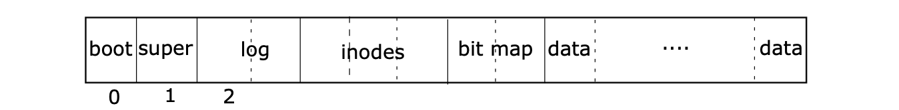

# 文件系统


通过xv6的在qemu中的启动命令
```bash
qemu-system-i386 -serial mon:stdio -drive file=fs.img,index=1,media=disk,format=raw -drive file=xv6.img,index=0,media=disk,format=raw -smp 2 -m 512 
```
可以看到，xv6设置了两块硬盘，一块index=0是存储系统内核xv6.img, 实际上这块硬盘没有文件系统，就是单纯的把boot loader和kernel文件逐个字节拷贝进来的。另一块index=1，这一块是有文件系统的，并且文件系统存储的是user programe，这块硬盘的初始数据是由mkfs.c生成的.

## 硬盘布局

xv6的文件系统在硬盘上的布局如下


第一扇区boot没有用到，super, log, inodes, bit map 是文件系统的元数据区段。 data是文件系统的data block区段。

* super：记录硬盘的整体状态，包括：以数据块个数为计量的硬盘的总大小，data 	区段中 data blocks的个数，inodes区段中inode的个数, log区段的数据块的个数，还有这几个区段的起始位置。
* log : 做crash recovery用的数据块
* inodes: 每个inode对应一个文件，文件类型可能是文件/目录/设备，inode里记录了文件类型，文件大小，以及存放文件内容的数据盘块地址编号等。如果inode是目录类型，文件内容块里存放的就是该目录所包含的文件记录，每条文件记录包含文件的inode编号和文件名称等。
* bit map: 是标记每个数据盘块是否被占用。