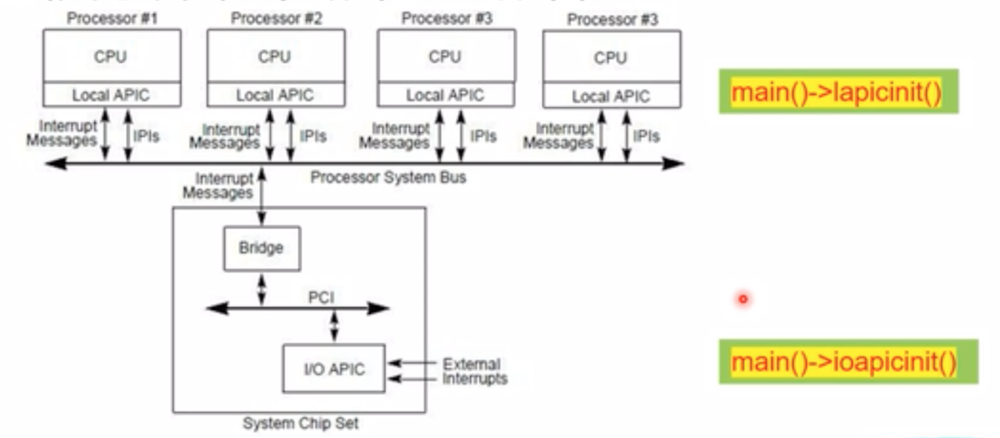
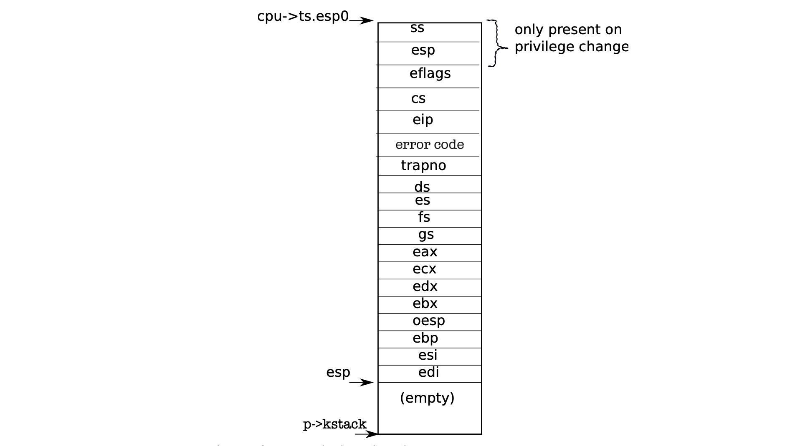

# 中断处理

## 中断的三种类型
系统中断的发生分为三种情况：

* 第一种 Systems calls（系统调用）, 即用户程序向内核发起一个系统服务申请，看起来类似一个方法调用，比如sleep, write。
* 第二种 exceptions（软件异常）, 也就是当程序执行了一个非法的操作，例如访问一个页表记录里根本不存在内存。
* 第三种 interrupts（硬件中断），即一个设备产生一个需要操作系统关注的信号，例如时钟芯片每隔100 msec 产生一个中断信号以允许内核实现一个分时系统。再比如当硬盘完成了一个数据块的读取，会产生一个中断告诉系统这个块已经准备好了，可以个取数据了。


其中硬件中断又可以分为处理器上的本地高级可编程中断控制器产生的（Local APIC ）和 主板上的输入输出高级可编程中断控制器产生的（I/O APIC ）, 这两种中断控制器的初始化代码分别是lapic.c中的lapicinit方法和ioapic.c中的ioapicinit方法。其中Local APIC产生的中断就交给APIC所在的processor处理，而I/O APIC产生的中断会由PIC总线经过北桥到处理器系统总线路由到操作系统指定的processor上处理。如下图所示：



在上面讲述的中断类型中， Systems calls是与当前进程有关系的，它是由当前进程发起的进而产生的。而interrupts未必与当前进程有关联，比如一个磁盘会在它完成数据块的获取后产生一个中断，但是在这个中断发生的时候其他的进程正在运行。

## 中断描述符表（IDT）
x86有256个不同的中断，其中编号0-31代表软件异常，32-63代表硬件中断，64代表系统调用。每个中断所对应处理入口定义在中断描述符表（IDT）里。在xv6系统中IDT在Tvinit中初始化，例如对应系统调用的那条中断记录的代码如下
```
SETGATE(idt[T_SYSCALL], 1, SEG_KCODE<<3, vectors[T_SYSCALL], DPL_USER);
```
而SETGATE这个宏接口定义如下
```
// Set up a normal interrupt/trap gate descriptor.
// - istrap: 1 for a trap (= exception) gate, 0 for an interrupt gate.
//   interrupt gate clears FL_IF, trap gate leaves FL_IF alone
// - sel: Code segment selector for interrupt/trap handler
// - off: Offset in code segment for interrupt/trap handler
// - dpl: Descriptor Privilege Level -
//        the privilege level required for software to invoke
//        this interrupt/trap gate explicitly using an int instruction.
SETGATE(gate, istrap, sel, off, d)    
```
其中的sel和off给出了处理中断时%cs 和 %eip两寄存器会被赋予的值，也就是说这两个值决定了中断处理的入口。

d也就是DPL代表这条中断的特权级别，x86有0（最高）到3（最低）4个特权级别，而在实际应用中只用到两个级别0和3，分别代表内核模式和用户模式。当前运行的指令的特权级别是被存放在%cs寄存器的低三位中，用CPL代表。如果CPL的特权级别小于DPL，那么系统是不允许int代码产生这个中断的，如果尝试这样做则会产生一个编号为13的异常中断。在上面代码中系统调用中断描述符的特权级别是DPL_USER，这样就允许用户程序使用int指令产生这个中断。

istrap如果是0， IF 标记会被清除，阻止其他中断产生。如果是1，IF标记会保持原来的值。


##  task status segment 

当系统进程由用户模式进入内核模式后，进程原来在用户模式使用的栈也应该切换为另该进程在内核模式下使用的栈，所以CPU要知道内核栈所在的地址，这个地址记录在一个 task status segment中，而task status segment的位置和大小记录在 global descriptor table (GDT)中的一条descriptor中，这条记录的索引是SEG_TSS，这个索引由ltr指令保存到tr寄存器的segment selector部分中。完成segment selector的保存后，处理器就用这个segment selector定位到 global descriptor table（GDT）中的TSS段，然后把这个段的 segment limit 和 base address也保存到tr寄存器的其他部分中。

task status segment 的设置是在switchuvm中完成的。

## 中断发生后系统做了那些事情？
### 保存寄存器状态

当一个中断发生时CPU会做下面几件事情：

* 1) 如果处理器是在用户模式下运行那么它首先要把用户栈切换为该进程的内核栈，具体就是从task register 记录的task status 对象中加载%esp 和 %ss寄存器，然后把旧的%ss 和 %esp保存到这个新栈中。如果中断发生在内核模式下，这一切都不会发生。
* 2) 处理器把%eflags, %cs, 和 %eip保存到栈中。有一些中断比如 page fault ，处理器还会保存一个error字。
* 3) 处理器从相关的中断表（IDT）找到中断处理的入口并跳转到相应的处理入口处，具体就是从相关IDT记录中加载%eip 和 %cs，进入内核模式运行。

以上是中断发生后CPU自动做的事情，在进入中断处理入口后就是操作系统要做的事情了。中断入口定义在vectors.S中，这个文件是由vectors.pl 这个 Perl 脚本生成的。vectors.S里面每一条记录对应一个中断处理的入口，256个中断就有256条记录。

* 4) 每条中断处理的入口代码做的事情基本相同，push一个错误代码0（如果中断本身就会产生错误代码，例如上面讲到的CPU自动做的事情的第二步中的page falt, 这里就会省略这个push，这么做是为了保持栈的一致性）和一个中断编号，然后跳转到alltraps。
* 5) Alltraps 继续保存寄存器的值，它把%ds, %es, %fs，%gs push到栈中，然后pushal把通用寄存器(%eax, %ecx, %edx, %ebx, %oes, %ebp, %esi, %edi)都push到栈中。

上面一系列的步骤就是构造了一个trapframe。trapframe 在 kernel stack中的布局如下：



在进入中断处理器之前CPU已经设置了%cs和%ss段寄存器，alltraps 继续完成 %ds 和 %es 段寄存器的设置。


### 执行trap函数

上面已经把中断发生时CPU寄存器的状态保存到了trapframe中，下面就要开始执行trap函数了。上面已经说明了此时的栈顶指针%esp就是指向trapframe，因此把%esp push到栈中作为trap函数的参数, 。然后调用trap函数，该函数是用来处理各种类型的中断,根据中断编号分配给具体的Interupte handler 去处理，在trap函数完成后返回，接着alltraps 通过执行`addl $4, %esp`把trap函数参数从栈中移除。最后系统又要通过trapret返回到中断原来发生的地方继续执行了，具体就是从trapframe中依次恢复各个寄存器的状态，这段代码已经在“第一个用户进程”那一章的返回用户程序的时候捋过了。

值得一提的是如果中断发生在系统正在内核模式下运行的时候，系统不会进行栈的切换也不会保存栈的段寄存器%ss和栈指针寄存器%esp，trapret的iret指令页无需恢复%esp和%ss。


