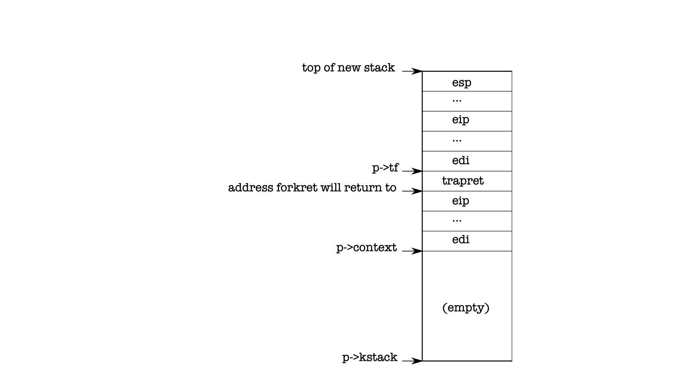

# 第一个进程

什么是进程？从概念上讲，进程是对一台机器的抽象，它可以给用户一种享有单独的处理器和内存的假象。从具体实现上讲，进程就是CPU寄存器的状态和虚拟内存的页表。

## 第一个进程的创建

系统的第一个进程初始化在 userinit 函数里完成。该函数首先调用 allocproc 分配一个进程对象，系统每个进程对象都要通过allocproc分配， 系统第一个进程也不例外。在allocproc中我们从进程列表（ptable）中申请到一个状态为UNUSED的进程， 申请到进程后设置它的状态为EMBRYO，并分配一个进程编号。然后要为该进程分配一个内核栈，每个进程有一个内核栈，一个用户栈，内核栈是该进程进入内核模式下运行所使用的栈，用户栈是该进程在用户模式下使用的栈。继续看allocproc函数的代码，可以看到进程的trapframe和context也在这个分配的内核栈中。trapframe作用是在进程发生中断时保存的当前进程寄存器的状态，然后在中断完成时恢复进程寄存器的状态。在userinit中可以看到trapframe在这里是用来保存用户模式下各个寄存器的状态。比如`p->tf->cs = (SEG_UCODE << 3) | DPL_USER` 这里的DPL_USER（=3）就是用户模式的特权级别，特权级别分三个等级，等级最高的值是0，最低的值是3, 低级别指令的不能访问高级别的段地址，xv6系统只用了两个级别0和3，内核模式是0，用户模式是3。再比如eip在这里设置为0,是该进程的入口地址。context是系统在进行调度时把当前的寄存器状态保存在旧的context里，然后把寄存器设置为新的context里的值。完成内核栈的分配后，它的布局如下：




 userinit的下一步就是要分配虚拟内存的页表，这是通过setupkvm()实现的。setupkvm给进程分配了一个页表，并初始化了内核的映射。内核内存空间设置完毕后，调用`inituvm(p->pgdir, _binary_initcode_start, (int)_binary_initcode_size)`设置这第一个进程的用户内存空间，_binary_initcode_start和_binary_initcode_size分别是“initcode.S”的起始地址和长度，这两个变量是由链接器根据MakeFile的设置
```
kernel: $(OBJS) entry.o entryother initcode kernel.ld
	$(LD) $(LDFLAGS) -T kernel.ld -o kernel entry.o $(OBJS) -b binary initcode entryother
```
自动加到elf文件里的。inituvm会分配足够的内存空间并把initcode.S对应的编译代码拷贝进来。 最后userinit把进程的状态设置为RUNNABLE，表示这个进程可以被调度进cpu运行了。


## 第一个进程的运行

上面已经完成了第一个进程的创建，然后在前面讲的“scheduler”运行起来的时候，就会发现这个新创建的进程，然后通过swtch把这个进程运行起来。
 
还记得这第一个进程的context是在allocproc中设置的，%eip=forkret，其他寄存器=0。所以最后ret指令返回到forkret函数。
forkret执行了一些必须在进程中运行的初始化工作，执行完成后会进入trapret。为什么会进入trapret呢？看上面的进程内核栈的布局图，进程context全部退栈以后，栈顶指针指向了trapret，所以forkret完成后返回到trapret了。trapret在'trapasm.S'文件里定义，代码如下：

```
 # Return falls through to trapret...
.globl trapret
trapret:
  popal
  popl %gs
  popl %fs
  popl %es
  popl %ds
  addl $0x8, %esp  # trapno and errcode
  iret
```
这里实际就是把进程trapframe保存的值恢复到寄存器中。为什么是这样呢？还是根据前面讲到的进程内核栈布局，当trapret退栈以后栈顶指针刚好指向进程的trapframe，还记得这个trapframe 是在userinit里设置的。一系列的pop指令把各个寄存器状态恢复，`addl $0x8, %esp`是略过trapframe里的trapno 和 errcode,最后的iret把指令寄存器%eip %cs和栈寄存器 %esp %ss 从trapframe中恢复，系统进入用户模式，开始运行initcode.S的代码。

## 运行initcode.S

initcode.S 实际就是手动制作了一个系统调用，首先`pushl $argv` , `pushl $init` 作为系统调用的参数。然后`pushl $0 `是系统调用的返回地址, 实际调用exec不会返回，这个地址只是占位用的。最后`movl $SYS_exec, %eax` 是把eax设置为代表exec的系统调用的编号，并执行 int T_SYSCALL 发起一个系统调用的中断，相内核申请运行exec系统调用（关于系统调用和中断处理流程参见后面的“中断处理”和“系统调用”章节）。exec系统调用服务根据用户程序传入的参数"init",把initcode 替换为init并运行。“init”开启了一个控制台shell.
 


